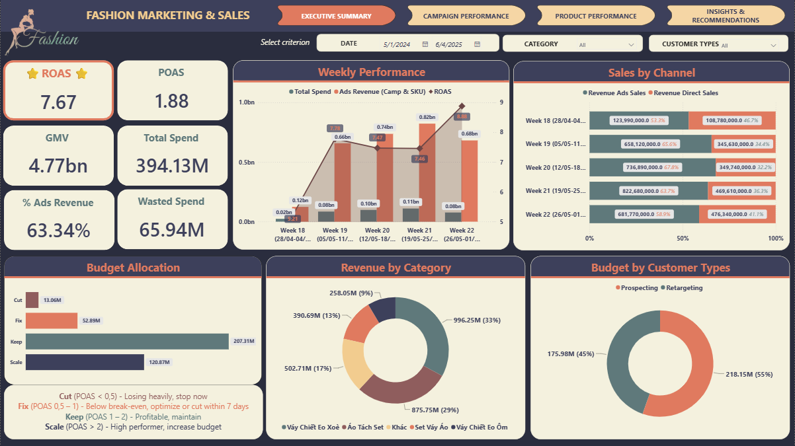
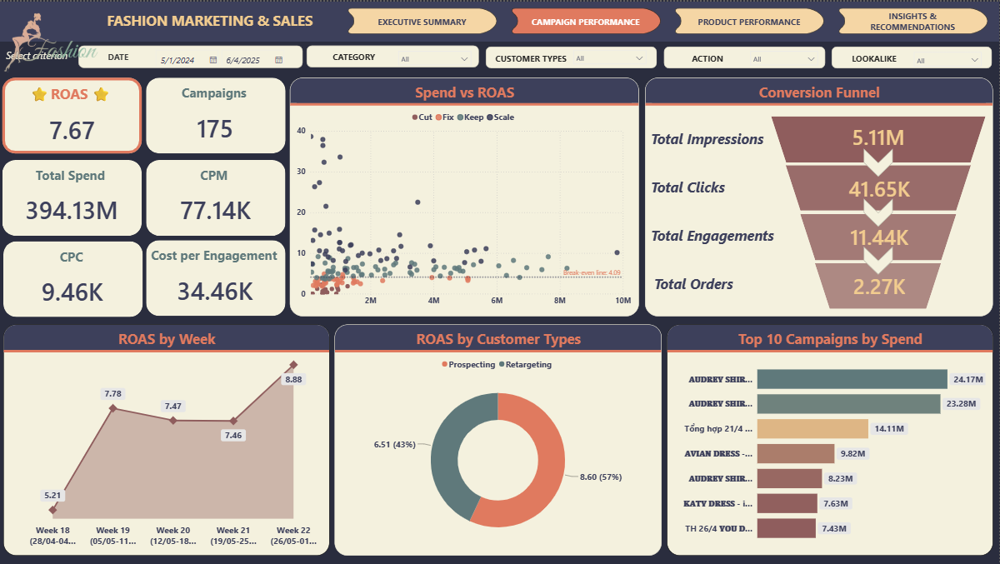
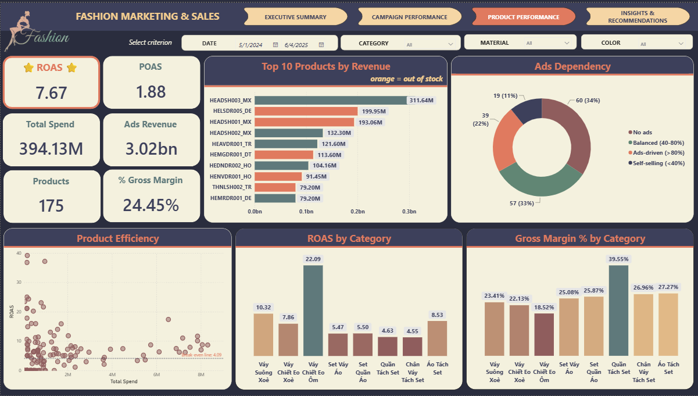
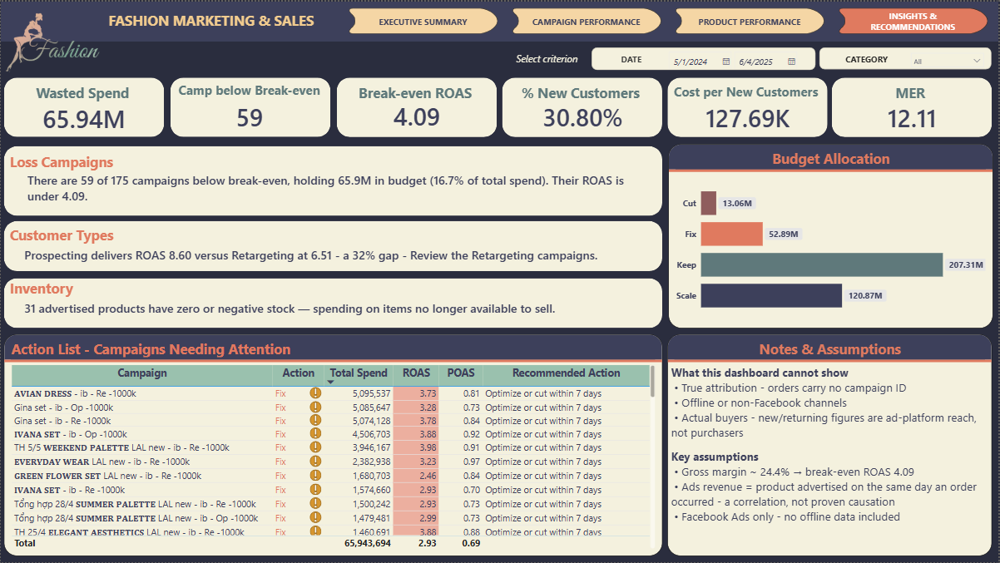
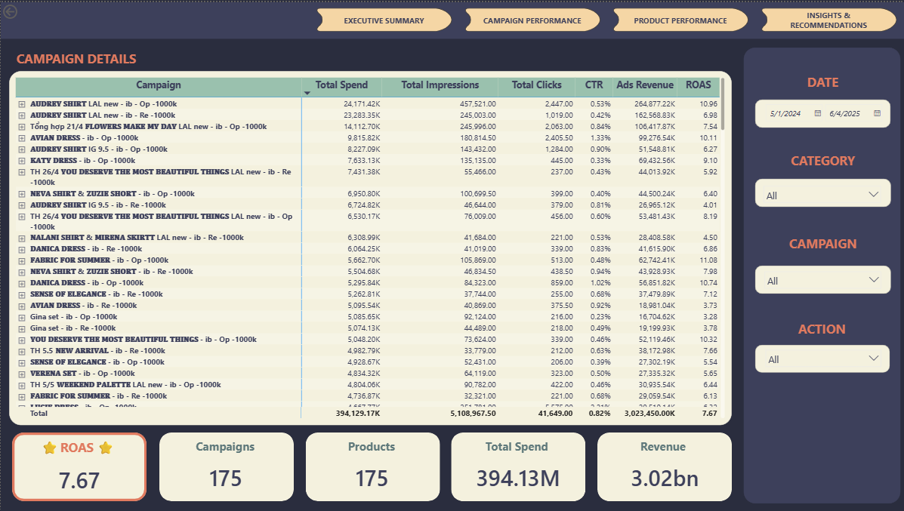
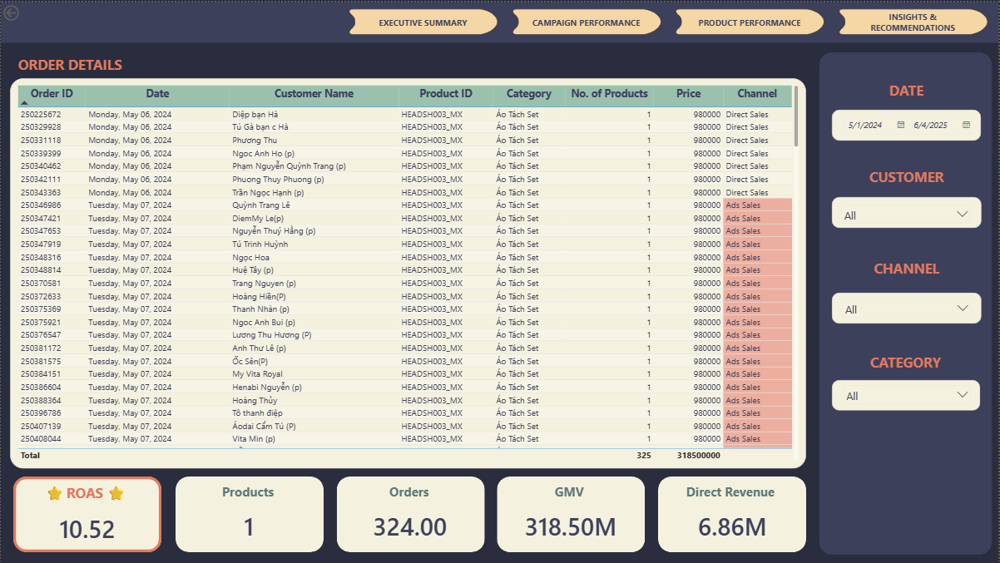

# Marketing Performance Analytics — Linking Ad Spend to Profit

A Power BI report for a fashion retail & e-commerce company that connects Facebook Ads spend to sales revenue at the campaign and product level, so the marketing team can see not just *what sells* but *what actually makes money*.

| | |
|---|---|
| **Tools** | Power BI (Power Query, DAX, data modelling), Design Thinking |
| **Dataset** | Facebook Ads cost + e-commerce orders, fashion retailer |
| **Period analysed** | May 2024 (data refreshes continuously) |
| **Records** | 3,451 orders · 3,844 ad-cost rows · 854 campaign-day units · 2,250 products |
| **Model** | Star schema · 2 facts + 4 dimensions · 42 measures |
| **File** | [`Marketing_Performance.pbix`](Marketing_Performance.pbix) |

---

## Key takeaways

- **The company is profitable on ads, but not by as much as the headline suggests.** Blended ROAS is **7.67**, which looks excellent — but once cost of goods is included, every ad dong returns **1.88** in gross profit (POAS), and the real break-even sits at **ROAS 4.09**, not 1.
- **59 of 175 campaigns are below break-even, holding 65.9M VND** — **16.7% of total ad spend** is running at a loss and could be reallocated.
- **Prospecting outperforms Retargeting by 32%** (ROAS 8.60 vs 6.51) at comparable spend, yet Retargeting still absorbs 176M VND — a clear reallocation opportunity.
- **31 of 175 advertised products have zero or negative stock** — ad money is being spent driving demand for items that can't be shipped.
- **37% of revenue comes from Direct Sales, not ads** — the business is less ad-dependent than a spend-only view would imply.

---

## Table of contents

1. [Business context](#1-business-context)
2. [Dataset](#2-dataset)
3. [Data preparation](#3-data-preparation)
4. [Data model](#4-data-model)
5. [Dashboard](#5-dashboard)
6. [Analysis and insights](#6-analysis-and-insights)
7. [Conclusion and recommendations](#7-conclusion-and-recommendations)
8. [Approach](#8-approach)

---

## 1. Business context

The company sells fashion products through an e-commerce store and runs paid acquisition mainly through Facebook Ads. The problem: **ad spend lives in one system, revenue lives in another, and the order table carries no campaign ID.** Every time leadership asked "are our ads profitable?", someone rebuilt an Excel merge by hand — a process that took days and produced numbers no one fully trusted.

The report answers four questions the marketing director asks on a weekly basis:

- How much was budgeted, how much was actually spent, and where is the gap?
- How is spend distributed across campaigns — over-concentrated or spread too thin?
- For every dong of ad spend, how much **profit** comes back (not just revenue)?
- Which campaigns and products should we cut, fix, keep, or scale?

The primary viewer is the **Marketing Director** (owns the marketing & e-commerce budget), reviewing weekly to make reallocation decisions.

---

## 2. Dataset

| Table | Rows | Role | Key fields |
|---|---|---|---|
| `Fact_Order` | 3,451 | Fact — revenue | order ID, date, product, qty, price, **channel (Ads/Direct)** |
| `Fact_Camp_SKU_Cost` | 3,844 | Fact — ad cost per SKU per day | campaign ID, product, date, spend, impressions, clicks, stock |
| `Dim_Camp_Cost` | 854 | Dimension — campaign | **campaign ID**, name, audience type, lookalike flag |
| `Dim_Product` | 2,250 | Dimension — product | product code, category, material, colour, **adjusted COGS** |
| `Dim_Date` | continuous | Dimension — calendar | date, week, month (marked as date table) |

---

## 3. Data preparation

### 3.1 Broken cost of goods on 110+ products

**Problem.** 110 of 1,762 priced products had a purchase cost **greater than or equal to their selling price** — one showed a cost-to-price ratio of 14,300. Used directly, these produce fake negative profit and make POAS meaningless.

**Fix.** In Power Query I flagged a valid cost ratio as between 0.2 and 0.9 (the distribution has a natural trough at 0.85–1.0, then a spike of impossible values above 1.0). For invalid products I interpolated `Adjusted COGS = selling price × the category's median valid ratio`, and marked every estimated value with a `COGS Estimated` flag. 40 of the 175 advertised products were interpolated this way.

### 3.2 Two systems, no shared key

**Problem.** Orders have no campaign ID, so ad cost and revenue can't be joined directly.

**Fix.** Both facts join to `Dim_Product` (product code) and `Dim_Date` (date). An order counts as *Ads Sales* if that product ran ads on the same day the order occurred — this reconciles exactly to the ad-revenue measure (3,023,450,000 VND from both tables independently). It is a **same-day correlation, not proven causation.**

### 3.3 Campaign key, and continuous refresh

The raw data had 12 cases where one campaign ran two ad sets on the same day, which broke naive de-duplication. The team's `Campaign ID` (854 unique) resolves this — one key per campaign-day-adset. The dataset also refreshes daily and grows across months, so `Dim_Date` auto-expands and every time visual uses weekly granularity to stay stable.

---

## 4. Data model

Star schema — two fact tables sharing conformed date and product dimensions:

```
                    Dim_Date
                       |  (date)
        +--------------+---------------+
        |              |               |
   Fact_Order   Fact_Camp_SKU_Cost   Dim_Camp_Cost
   (revenue)      (ad cost) ---------- (campaign ID)
        |              |  (product)
        +------+-------+
            Dim_Product
```

**Measure layers (42 total):**

| Layer | Examples | Purpose |
|---|---|---|
| Base | Total Spend, Revenue of Ads, Impressions, Clicks | Raw sums from the ad fact |
| Efficiency | CTR, CPM, CPC, **ROAS** (northstar) | Standard funnel diagnostics |
| Profitability | Gross Profit, **POAS**, Gross Margin %, **Break-even ROAS** | Profit reality-check layer |
| Channel | GMV, Revenue Ads/Direct, % from Ads, MER | Ads-vs-direct split |
| Customer | New/Returning, % New, Cost per New Customer | Acquisition view |
| Action | Action Bucket, Wasted Spend, dynamic insight strings | Turns numbers into decisions |

**Dynamic insight text.** Every number on the Insights page — including the campaign counts and the "best audience" name — is generated by DAX, not typed, so the written summary can never drift from the model:

```dax
Insight Wasted =
"There are " & [Campaigns Below Break-even] & " of " & [Campaign Count] &
" campaigns below break-even, holding " &
FORMAT ( [Wasted Spend] / 1000000, "0.0" ) & "M in budget (" &
FORMAT ( DIVIDE ( [Wasted Spend], [Total Spend] ), "0.0%" ) &
" of total spend)."
```

**Break-even, driven by margin.** The line that separates profitable from loss-making campaigns is itself a measure, so it moves automatically if the gross-margin assumption is revised:

```dax
Break-even ROAS = DIVIDE ( 1, [Gross Margin %] )
```

---

## 5. Dashboard

Six pages across three tiers: **Overview** (leadership, 30-second read) → **Analysis** (3 pages, diagnosis) → **Transaction** (2 hidden pages, reached by **drill-through** for record-level lookup).

### Executive Summary — *is marketing healthy, and where is the money going?*


### Campaign Performance — *which campaigns to cut, keep, or scale?*


### Product Performance — *which products deserve ad budget?*


### Insights & Recommendations — *what should marketing do next week?*


### Drill-through to record level

The two analysis pages don't stop at the aggregate. Right-clicking any campaign or product — or using the drill-through button — jumps to a hidden detail page filtered to just that item, so a manager who spots an underperforming campaign can see its underlying SKU-and-day rows without leaving the report.

- **Campaign Detail** (from Campaign Performance) — a matrix drilling Campaign → SKU → Day, carrying the selected campaign's context through so the page opens already filtered.
- **Order Detail** (from Product Performance) — a flat, exportable order-line table for the selected product, tagged by channel (Ads / Direct).




Both detail pages are hidden from the navigation bar and reachable only by drilling, keeping the leadership view clean while giving operations staff a record-level lookup one click away. Each carries a live summary bar that recalculates as filters narrow — so "how many campaigns / how much spend does this selection cover" is always answered on screen.

---

## 6. Analysis and insights

### 6.1 The headline ROAS hides the real economics

Blended **ROAS is 7.67** — on its own, a number that says "keep spending". But ROAS counts revenue, not profit. With an estimated **gross margin of 24.4%**, the true break-even is **ROAS 4.09**, and profit-on-ad-spend (**POAS**) is **1.88**.

**Insight.** ROAS and POAS rank campaigns almost identically (correlation 0.99), so POAS adds no new *ranking* — its value is the **absolute break-even line**. A campaign at ROAS 2.46 looks merely "weak" until POAS 0.84 reveals it is actually losing money. This is why the report leads with ROAS (the team's standard) but pairs it everywhere with a POAS break-even reference line.

### 6.2 One dong in six is running at a loss

**59 of 175 campaigns** sit below break-even, absorbing **65.9M VND — 16.7% of total spend.**

**Insight.** The money isn't evenly spread: the *Cut* group is only 13M across 21 campaigns (bleeding slowly), while *Fix* holds 53M across 38 campaigns (the real drain). Fixing or cutting the *Fix* group is the single highest-value action on the board.

### 6.3 Prospecting beats Retargeting — but gets similar budget

Prospecting campaigns return **ROAS 8.60**; Retargeting returns **6.51** — a **32% gap** at comparable spend (218M vs 176M VND).

**Insight.** This is counter-intuitive — retargeting a warm audience "should" convert better. The gap suggests the retargeting pool is saturated or the creative has gone stale. Shifting budget toward prospecting, or refreshing retargeting creative, is a concrete next step marketing owns entirely.

### 6.4 Ads are running for out-of-stock products

**31 of 175 advertised products have zero or negative inventory.** The single highest-ROAS product (43.7) has stock of **−146**.

**Insight.** Pure efficiency metrics would flag this product to *scale* — exactly the wrong call. The Product page pairs revenue with an inventory guardrail (out-of-stock bars turn red) so no one scales spend into a stockout.

### 6.5 The business is less ad-dependent than it looks

**37% of GMV (1.75bn VND) comes from Direct Sales**, not ads. Blended **MER is 12.11** against an ads-only ROAS of 7.67.

**Insight.** A spend-only view overstates how much the business rides on paid acquisition. The channel split reframes the ad budget as one lever among several.

---

## 7. Conclusion and recommendations

**What the data says.** Ads are profitable overall (POAS 1.88), but a sixth of the budget is losing money, prospecting is underfunded relative to its returns, and some spend is chasing unsellable stock. The headline ROAS of 7.67 is real but misleading without the 4.09 break-even.

Recommendations, all inside the marketing team's control:

1. **Cut the 21 loss-making *Cut* campaigns immediately** — recovers ~13M VND with no downside.
2. **Fix or cut the 38 *Fix* campaigns within a week** — 53M VND at stake; the largest single lever.
3. **Shift budget from Retargeting toward Prospecting**, or refresh retargeting creative — closes a 32% efficiency gap on 176M of spend.
4. **Pause ads on out-of-stock products** until inventory returns.

**Limitations.**
- **Attribution is same-day correlation, not causation** — orders carry no campaign ID, so campaign-level profit is a ranking tool, not an accounting figure.
- **Gross margin (24.4%) is an estimate pending leadership confirmation** — it is low for fashion (typically 50–65%), which may mean purchase cost includes other costs. It directly sets the 4.09 break-even, so all Cut/Fix/Keep/Scale thresholds move with it.
- **New/returning customer counts are ad-platform reach, not verified buyers** — "cost per new customer" is not true CAC.
- **Facebook Ads only** — no offline or other-channel data.

---

## 8. Approach

This report was built with a **Design Thinking** process (Empathise → Define → Ideate → Prototype → Review), documented in [`Design_Thinking.xlsx`](Design_Thinking.xlsx). Two decisions from that process shaped the whole report:

- **Choosing the northstar.** POAS was considered as the primary metric because it reflects profit, but ROAS was chosen because it is the team's shared standard, is directly controllable by marketing, and rests on clean data. POAS became the profitability reality-check beside it.
- **Three-tier page structure.** Rather than one dense page, the report separates leadership overview from analyst diagnosis from operational lookup — each tier serving a different reader and question.

---

*Data is anonymised sample data from a fashion retailer. Figures in this README reconcile to the published `.pbix` model.*
